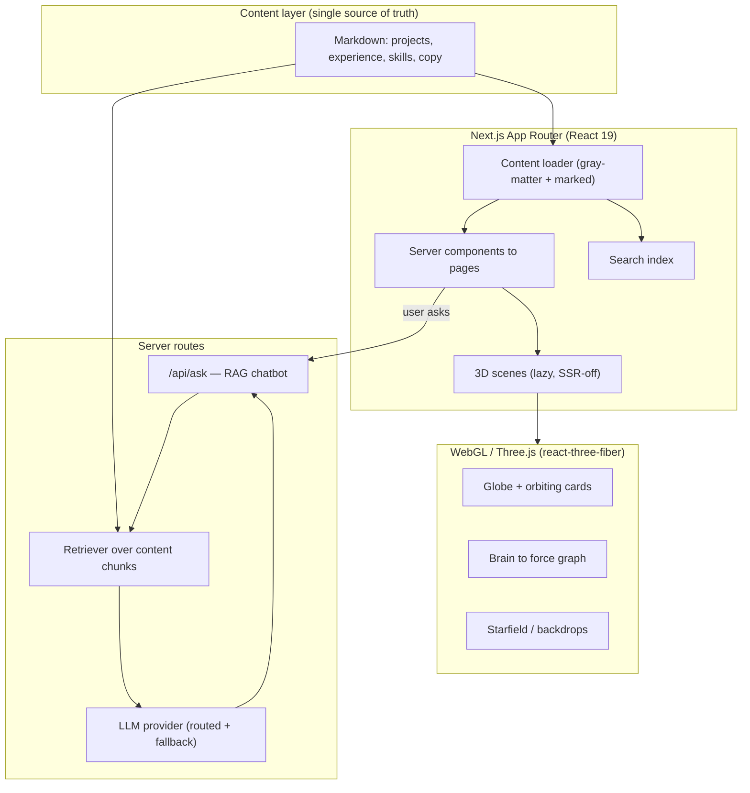

<div align="center">

# Niranjan VSKS — Forward Deployed Engineer Portfolio

**An interactive, 3D portfolio for a Senior Agentic AI Engineer — a living document of how I discover, architect, build, and ship production AI systems into enterprise environments.**

[](https://nextjs.org/)
[](https://react.dev/)
[](https://www.typescriptlang.org/)
[](https://tailwindcss.com/)
[](https://threejs.org/)
[](https://niranjanvsks.xyz)

**[🌐 Live site → niranjanvsks.xyz](https://niranjanvsks.xyz)**

</div>

---

## Overview

I am **Niranjan VSKS**, a Senior Agentic AI Engineer focused on building production-ready AI systems for enterprise customers — taking ideas from customer discovery through architecture, implementation, deployment, and adoption. My background spans LLMs, GraphRAG, multi-agent systems, LLM observability, and full-stack engineering.

This repository is that story rendered as software: a dark, cinematic, fully interactive portfolio where every section is a small piece of engineering rather than a static page. It is content-driven, animated with hand-built 3D WebGL scenes, and includes a retrieval-grounded chatbot that answers questions about my work from the same content that renders the site.

---

## ✨ What's built

- **3D globe hero** — an opaque, self-rotating earth (custom day/night, city-lights, cloud, and atmosphere shaders) with a ring of **terminal-style cards orbiting it in real 3D space**. Each card is a section of the site; the focused card comes forward, and clicking it routes you in.
- **Interactive mind map** — the whole body of work as one connected graph. It opens with a **glowing particle "brain" animation** that dissolves into a force-directed node graph — the visual metaphor (a brain) deliberately resonates with the theme (a connected system of ideas). Nodes are projects, employers, skills, and capabilities; hovering lights up a node's neighbourhood, clicking routes to its page.
- **ask_niranjan chatbot** — a streaming, retrieval-grounded assistant. It answers only from my real project write-ups, routes across LLM providers with graceful fallback, and is rate-limited and guardrailed so it stays on-topic and never fabricates.
- **System Design surfaces** — reference architectures with interactive, shape-coded node-and-edge diagrams (distinct shapes for triggers, data sources, models, gates, and stores) plus requirements and trade-offs.
- **Smooth, theme-resonant motion throughout** — a first-visit loader, encrypted/typewriter text, layout-flip headlines, spotlight and flip cards, a starfield backdrop, and route transitions — all tuned to honour `prefers-reduced-motion` and to degrade gracefully on mobile.
- **Content-driven everything** — projects, experience, skills, and copy live as Markdown; components render from a single content layer, and indexes (search, footer, mind map) derive from it, so adding a project updates the whole site.

---

## 🏗 Architecture



**Design principles**

- **One source of truth.** Markdown content feeds both the rendered pages and the chatbot's retrieval, so the site can never contradict itself.
- **3D is gated and cheap.** Every WebGL scene is lazy-loaded (`next/dynamic`, `ssr: false`), Suspense-wrapped, capped at a sane pixel ratio, disposed on unmount, frozen under reduced-motion, and given a documented fallback below the mobile breakpoint.
- **Grounded AI.** The chatbot retrieves relevant content chunks first and answers only from them, with provider routing + fallback, rate limiting, and guardrails.

---

## 🔀 Application flow

1. A visitor lands on the **globe hero**; the section cards orbit and route on click.
2. Navigating anywhere renders a **server component** that pulls copy from the **content loader** — no strings are hardcoded in components.
3. Heavy **3D scenes** mount client-side only, behind a loader, and reveal in a single crossfade once ready.
4. Asking the **chatbot** hits `/api/ask`, which retrieves the most relevant content chunks, streams an answer from an LLM provider (with fallback), and stays grounded in real write-ups.
5. **Search, footer, and mind map** all derive their entries from the content layer, so the whole site stays in sync automatically.

---

## 🧰 Tech stack

| Layer | Choice |
|---|---|
| Framework | Next.js 16 (App Router), React 19 |
| Language | TypeScript |
| Styling | Tailwind CSS 4, dark-first design system |
| 3D / WebGL | Three.js via `@react-three/fiber` + `drei`, custom GLSL shaders |
| Graph / diagrams | Force-directed 3D graph, React Flow node-and-edge diagrams |
| Content | Markdown + gray-matter + marked (content-as-data) |
| AI | Retrieval-grounded chatbot, provider-routed LLM calls, rate limiting |
| Tooling | ESLint, TypeScript strict, Playwright verification suite |
| Hosting | Vercel |

---

## 🚀 Getting started

```bash
# install
npm install

# run the dev server
npm run dev            # http://localhost:3000

# production build
npm run build
npm run start

# checks
npx tsc --noEmit       # types
npm run lint           # lint
npm run test:verify    # Playwright route + content checks
```

Environment variables are optional — the site runs without them and the chatbot degrades gracefully. Copy `.env.example` to `.env.local` and fill in the LLM provider key(s) and model if you want the live chatbot. Nothing secret is committed.

---

## 📁 Project structure

```
src/
  app/            App Router routes + API routes
  components/
    3d/           WebGL scenes (globe, brain, starfield)
    sections/     page sections (hero, chat, footer, ...)
    ui/           reusable UI (cards, loaders, text effects)
  lib/            content loader, search index, RAG retrieval, hooks
portfolio-assets/
  content/        Markdown: projects, experience, skills, copy
public/           images, video, resume, architecture diagrams
tests/verify/     Playwright verification suite
```

---

## 📫 Contact

- **Live site:** [niranjanvsks.xyz](https://niranjanvsks.xyz)
- **Email:** niranjan.vsks@gmail.com
- **LinkedIn:** [in/niranjanvsks](https://www.linkedin.com/in/niranjanvsks)

<div align="center">
<sub>Designed, engineered, and shipped end to end.</sub>
</div>
